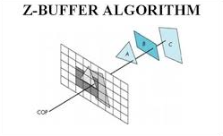
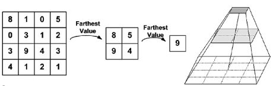
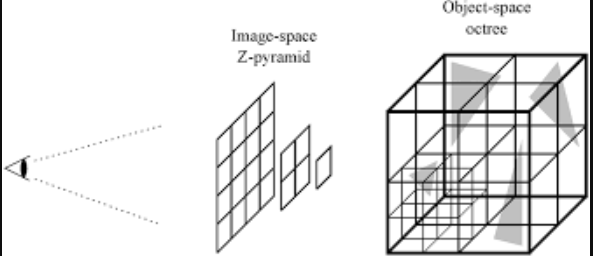
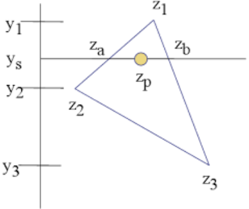
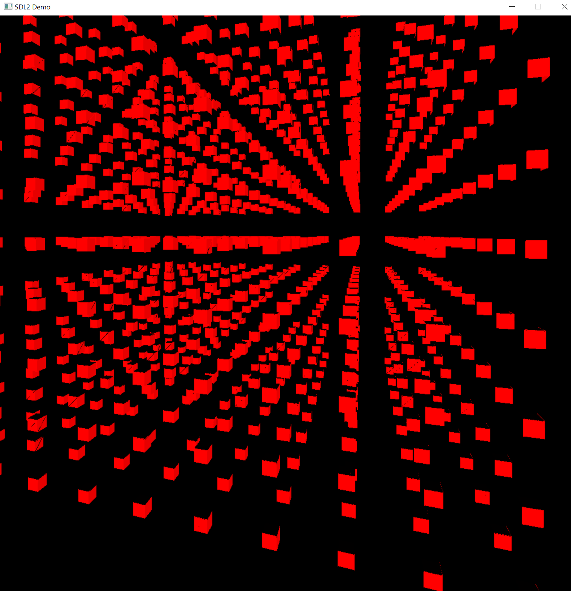
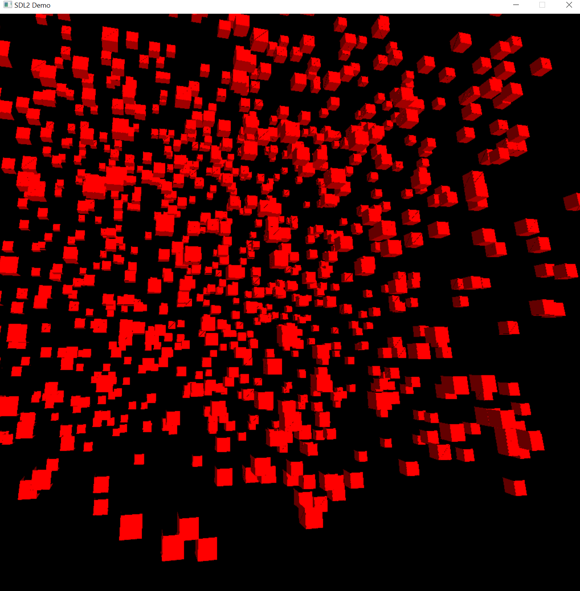
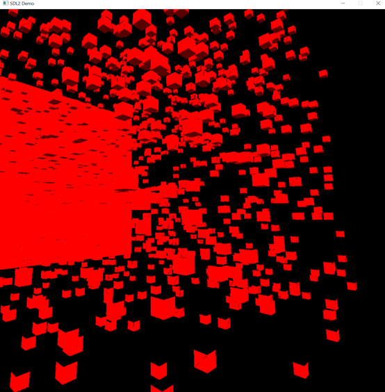
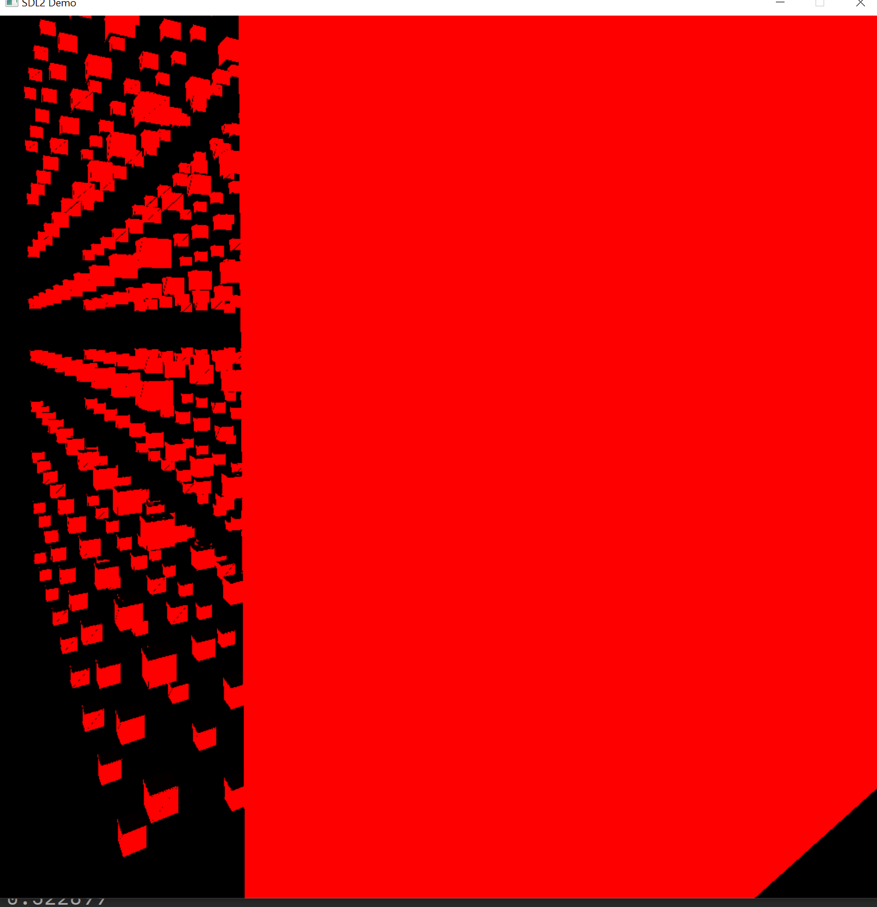
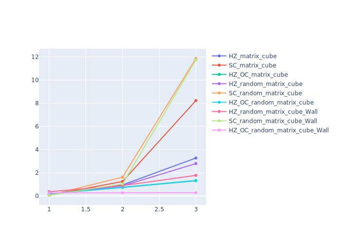

# Render based CPU 
In this render, I implement a  a scalable and powerful rasterization program with  SDL2, C++ standard library, openmp. 
This render can support kinds of ZBuffer, just like Zbuffer, Hierachy ZBuffer, Scanline ZBuffer, and Hierachy ZBuffer with Octree.
This render can support multiple mode to render geometry data， just like point, line, and face.
This render can also support cut screen. 
At the last of README, we provide a benchmark of different ZBuffer based on different scenes. 

在这个软光栅中，我用SDL2、C++标准库、OpenMP实现了一个可扩展和效果较好的的光栅化程序。
该软光栅可以支持多种ZBuffer，比如ZBuffer、Hierachy ZBuffer、Scanline ZBuffer和Hierachy ZBuffer with Octree。
这种渲染可以支持多种模式来渲染几何体数据，比如点、线和面。
此渲染还可以支持剪切屏幕。
在自述文件的最后，我们提供了一个基于不同场景的多种ZBuffer的对比。

## multiply ZBuffers 
These a simple instruction of different ZBuffers. 
下面我们对不同的Zbuffer做简单介绍和性能简单分析。

### Simple ZBuffer 
  
We support the most simple ZBuffer algorithm. 
最简单的Zbuffer数据结构效果如上所示。

### HierachyZBuffer
  
Our render supports the HierachyZBuffer. HierachyZBuffer can help reject to render triangles faster by reject 2d Box of projected triangles. But the HierachyZBuffer must maintain multiple simple ZBuffers, which means that replacing a pixel of Zbuffer will cost more computer power. Therefore, if your scene does not have enough occlusion relationship, HierachyZBuffer is not suitable for you. 
On the other hand, if your scene has abundant occlusion relationship, HierachyZbuffer can reject triangle(2d BOX) faster. 

我们的渲染支持HierachyZBuffer。HierachyZBuffer可以通过拒绝投影后三角形的2d包围框来帮助拒绝本不需要渲染的三角形。但是HierachyZBuffer必须维护多个简单的Zbuffer，这意味着替换HierachyZBuffer中的一个像素将消耗更多的算力。理想的情况是，我们先把近的三角形完全渲染，后面的三角形就可以快速的被拒绝，这样放大HierachyZbuffer的拒绝优势，缩小更改HierachyZbuffer的操作。但是如果场景中没有足够的遮挡关系，那么快速拒绝三角形的优势就没有办法发挥出来，同时修改HierachyZbuffer还有比简单Zbuffer更高的开销，那么这种情况下，HierachyZbuffer不适合您。综上所述，HierachyZbuffer适用于有丰富遮挡关系的场景，最好还能有新的手段，将更改HierachyZbuffer的操作降到最低。

### HierachyZBuffer and Octree
  
HierachyZBuffer can reject 2d Project Box faster but cost more for pixel substitution operation. We know the most triangles of all the scene may not have the chance to be rendered, so we can build the Split-tree of space, project the 3d Box to 2D box, and reject 2D box fastly. At the same time, we sort the box by the ViewDirection * (boxCenter - CameraPos) to guarantee the minimum number of substitution operation for HierachyZBuffer. 

HierachyZBuffer可以更快地拒绝2d投影盒，但内部像素替换操作的成本更高。我们知道所有场景中的大多数三角形可能没有机会被渲染，因此我们可以构建空间的分割树，使用3d box将场景中的三角形分块，然后将3d框投影到2D框，并通过HKZbuffer快速拒绝2D框。同时，为了将Zbuffer的像素替换操作降低到最低，我们按照ViewDirection*（boxCenter-CameraPos）对3d box进行排序，以保证HierachyZBuffer的替换操作次数最少。同时，如果我们只在观察方向ViewDirection变化够大的情况下，才对3d box进行重排序。

### ScanLineZBuffer
  
ScanlineZBuffer can help render scene without pixel substitusion operation of ZBuffer, but it must build complex data structure. 
If the objects of your scene are very big, the cost of buildding data structure will be reduced and the cost of buildding stable HierachyZbuffer will be raised.  

ScanlineZbuffer通过构造复杂的边面表，从而保证一次生成图像，而降低Zbuffer内部的pixel的替换; HKZbuffer通过排序3d box,先光栅化距离视点近的物体最大程度的降低pixel的替换,; 两者均降低了pixel替换的操作数目，但究竟是构建边面表的开销大，还是构造稳定层次Zbuffer的开销大？这一点需要详细的Benchmarker. 但这一疑问仅存在于那些存在大量，大的，互相遮挡物体的场景; 毫无疑问的是，如果你的场景中大量小而碎的物体, 构建ScanlineZbuffer的边表开销要远高于HKZbuffer。因为HKZbuffer的开销最差情况下是Zbuffer的常数倍，下界是简单Zbuffer复杂度的Level的长度倍(Level为层次Zbuffer的层次数)，但是SZBuffer的构建边面表的下界是一个更大的波动范围，在非常碎，链表非常长的情况下，下界是一定可以超过简单Zbuffer复杂度的Level长度倍。 
值得夸耀的是，我们同时提供了大而互相遮挡，小而碎且互相遮挡的场景做benchmark。 

## multiply module 

### point 
在geom的Point类中，实现了经典的画点的算法, 供您实现您的需求。 

### line 
在geom的Line类中，实现了经典的画线算法，供您实现您的需求。 

### face 
在geom的triangle类中，我们实现了经典的画三角形的算法，供您实现您的需求。 

这意味着，我们的软光栅提供了画 点，线，面的全面功能。 

## benchmark

我们提供了三种场景用于Zbuffer算法的benchmark，第一种场景是，大量遮挡的cube场景，第二种场景是小而碎的random场景。 第三种场景是，小而碎，但存在巨大遮挡物体。 

以下为三种场景的例子，使用从camera pos发出的平行光为例子（我们同时实现了点光源). 
### matrix Cube 场景 
  
10x10x10个cube构成的矩阵，大量层叠，不小不碎。是ScanLineZbuffer的优势场景。 

### random matrix cube 场景
  
大量随机的，相互交叠的cube构成的场景，小而碎，是为了弄清楚构建复杂边表的开销大，还是构造稳定的HKZbuffer开销大而设立的场景。 

### random matrix cube with big Wall 场景
  
  

大量随机的，相互交叠的cube构成的场景，但是存在一个巨大的遮挡物(墙)，当这个遮挡物遮挡了大部分的cube的时候，HKZbuffer和Octree的快速拒绝将发挥巨大优势。
是HKZbuffer+Octree的优势场景。 


## benchmark result for Zbuffers

基于动态操作的100帧统计，AMD3080 CPU, 

> - 基于动态操作的100帧统计, matrix Cube 场景:

```C++
12000 face (10x10x10x12) 0.15694 seconds a frame  HZ
12000 face (10x10x10x12) 0.06204 seconds a frame  SC (cube之间只有遮挡，没有交叠，所以最快)
12000 face (10x10x10x12) 0.18083 seconds a frame  HZ + OC (遮挡过少，维护数据结构开销更大)

96000 face (20x20x20x12) 0.95646 seconds a frame  HZ 
96000 face (20x20x20x12) 1.24884 seconds a frame  SC(因为cube太多已经出现同一层之间的大量交叠)
96000 face (20x20x20x12) 0.74526 seconds a frame  HZ + OC (因为cube已经出现交叠，所以快速拒绝派上了用场)

324000 face  (30x30x30x12) 3.27468 seconds a frame HZ 
324000 face  (30x30x30x12) 8.22607 seconds a frame SC (因为cube太多已经出现同一层之间的大量交叠)
324000 face  (30x30x30x12) 1.33333 seconds a frame HZ + OC (交叠越多, 边际成本越低)
```


> - 基于动态操作的100帧统计, random matrix Cube 场景:
```C++
12000 face (10x10x10x12) 0.15059 seconds a frame HZ 
12000 face (10x10x10x12) 0.06492 seconds a frame SC (因为random所以已经出现交叠)
12000 face (10x10x10x12) 0.19657 seconds a frame HZ + OC (遮挡过少，维护数据结构开销更大)

96000 face (20x20x20x12) 0.87428 seconds a frame HZ (random的遮挡增加了)
96000 face (20x20x20x12) 1.62253  seconds a frame SC (random增加了交叠的程度)
96000 face (20x20x20x12) 0.73281 seconds a frame HZ + OC (random增加了交叠的数目，快速拒绝派上用场)

324000 face  (30x30x30x12)  2.79457 seconds a frame HZ 
324000 face  (30x30x30x12)  11.8637 seconds a frame SC (random增加了交叠的程度)
324000 face  (30x30x30x12)  1.30824 seconds a frame HZ + OC (random增加了交叠的数目，快速拒绝派上用场)
```


> - 基于动态操作的100帧统计，random matrix Cube场景 + 墙遮挡

```C++
12000 face (10x10x10x12)  0.37130 seconds a frame HZ 
12000 face (10x10x10x12)  0.05700 seconds a frame SC 
12000 face (10x10x10x12)  0.27256 seconds a frame HZ + OC (全部由墙遮挡)

96000 face (20x20x20x12)  0.89561 seconds a frame HZ 
96000 face (20x20x20x12)  1.03912 seconds a frame SC
96000 face (20x20x20x12)  0.27923 seconds a frame HZ + OC (全部由墙遮挡, 有了Octree 拒绝速度更快)

324000 face  (30x30x30x12)  1.7794 seconds a frame HZ 
324000 face  (30x30x30x12)  11.7462 seconds a frame SC 
324000 face  (30x30x30x12)  0.28172 seconds a frame HZ + OC (全部由墙遮挡)

```


>以上过程使用图表示为:


>HZ代表层次ZBuffer,SC代表扫描线Zbuffer,HZ_OC代表层次+八叉树. 
>横坐标代表面片数,纵坐标代表时间(秒)
>如需重新测评, 需要改动代码,命令行封装正在进行. 